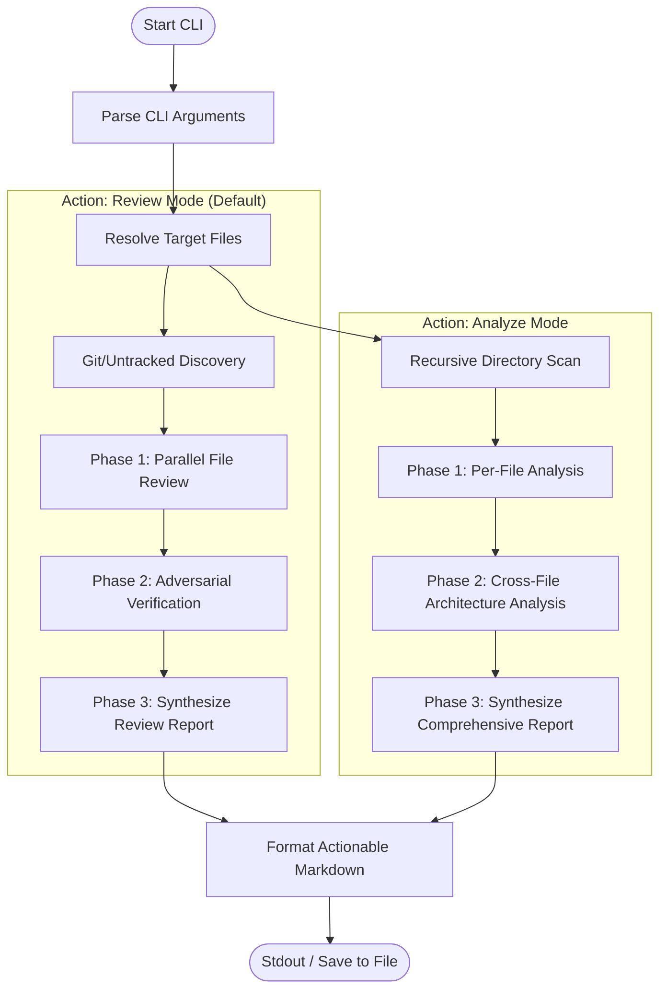

# Technical Design Document: Gemini Code Review Engine

A high-performance, zero-dependency, fan-out Code Review & Analysis CLI tool powered by the Gemini API. It features concurrent file reviews, an adversarial verification pipeline to filter false positives, recursive codebase architecture mapping, and automatic report synthesis.

---

## 1. Architectural Overview

The core design centers on a **3-Phase Pipeline** with two distinct operational actions: **Review Mode** and **Analyze Mode**.



---

## 2. Core Design Principles

### 2.1 Zero-Dependency & Lightweight Execution
The tool is written in vanilla Node.js using only built-in modules (`https`, `child_process`, `fs`, `path`). By bypassing bulky packages, the script initializes in milliseconds and runs smoothly on any Node 18+ environment.

### 2.2 Concurrency Limit & Resource Guarantee
A custom Promise-based Semaphore throttles concurrent HTTP API calls to prevent rate-limiting (HTTP 429).
* **Default Concurrency Limit**: 5 (Configurable via `--concurrency`)
* **Slot Safety Guarantee**: Every HTTP request is bound to a `120,000ms` timeout. If a call hangs, the Promise rejects, forcing the `finally` block to execute and release the concurrency slot.

### 2.3 Low-Randomness Factual Auditing
To prevent hallucinated findings:
* **Deterministic Generation Config**: Default `temperature` is locked strictly to **`0.1`** (Configurable via `--temperature`).
* **Strict Schema Compliance**: Leverages Gemini's native `responseSchema` to enforce structured JSON data extraction.

### 2.4 Command Injection Mitigation
All Git integrations use `spawnSync` with raw arguments passed directly as an array, encapsulated inside a secure `gitExec` helper. This completely removes shell injection risks.

### 2.5 API Resilience (Exponential Backoff)
Outgoing API calls are wrapped in a robust retry handler that automatically retries on rate limits (429), server errors (500, 503), timeouts, and network disconnects using exponential backoff and randomized jitter.

---

## 3. Code & Directory Structure

### 3.1 Workspace Layout
```text
gemini-code-review/
├── DESIGN_DOC.md           # This technical design document
├── README.md               # User-facing manual with workflow diagram
├── SKILL.md                # Skill SOP instructions for AI Agents
└── review-gemini.js        # Core review engine executable script
```

---

## 4. Operational Modes

### 4.1 Review Mode (`--action review`)
Designed to review specific files or incremental changes (diffs):
1. **Phase 1: Parallel Review**: Reads resolved files asynchronously (`fs.promises.readFile`), fetches the git diff securely, and requests structured bug & improvement findings.
2. **Phase 2: Adversarial Verification**: Filters high/critical findings and dispatches a skeptical validator tasked with disproving each finding (Devil's Advocate prompt).
3. **Phase 3: Synthesizer**: Compiles all confirmed findings into a final Markdown review report.

### 4.2 Analyze Mode (`--action analyze`)
Designed to provide a high-level architectural map of a codebase:
1. **Phase 1: Per-File Analysis**: Scans the target directory recursively, filters out large/ignored files, and parses each file for imports, exports, complexity, SOLID principles, and tech debt.
2. **Phase 2: Architecture Analysis**: Detects project configuration files (e.g. `package.json`, `Cargo.toml`) and uses Gemini to map out module dependencies, data flow, and layers (generating a Mermaid dependency flowchart).
3. **Phase 3: Synthesis**: Compiles a comprehensive codebase report containing stats, complexity rankings, security audits, and priority refactoring recommendations.

---

## 5. Technical Specifications

| Specification | Value / Technology |
| :--- | :--- |
| **Current Version** | `2.1.0` |
| **Language Runtime** | Node.js (>= 18.0.0) |
| **Model Engine** | `gemini-2.5-flash` (Default, configurable via `--model`) |
| **Default Concurrency** | 5 (Configurable via `--concurrency`) |
| **Default Temperature** | 0.1 (Configurable via `--temperature`) |
| **VCS Integrations** | Git (`diff`, `diff --cached`, `ls-files --others`) |
| **API Communication** | HTTPS Native POST requests to Google Generative Language API |
| **API Safeguards** | Exponential backoff retry loop (max 3 retries) |
| **Input Protection** | XML-tag escaping & jailbreak prevention headers |

---

## 6. Version History & Change Log

### **Version 2.1.0 (2026-06-04)**
*   **Output Language Support**: Introduced `--lang` parameter to support generating final reports (both review and analysis) in specified languages (defaulting to English).

### **Version 2.0.0 (2026-06-04)**
*   **Codebase Analysis Mode**: Introduced `--action analyze` to enable recursive directory scanning, project config analysis, and automated Mermaid dependency diagram mapping.
*   **Manual Git Divergence Resolution**: Unified divergent local and remote branches. Adopted remote's robust API retry mechanism and project structure parser while keeping local's temperature arguments, non-blocking asynchronous file reading, and unstaged/untracked git file resolution.
*   **Security & Command Sanitization**: Unified all Git subprocess spawning under a secure `spawnSync` wrapper (`gitExec`), preventing shell argument injection. Added input tagging to protect against prompt injection.
*   **Error Spam Control**: Added automatic truncation for raw API error payloads in output streams.

#gemini-code-review #design-doc #architecture #mermaid #2026-06-04
