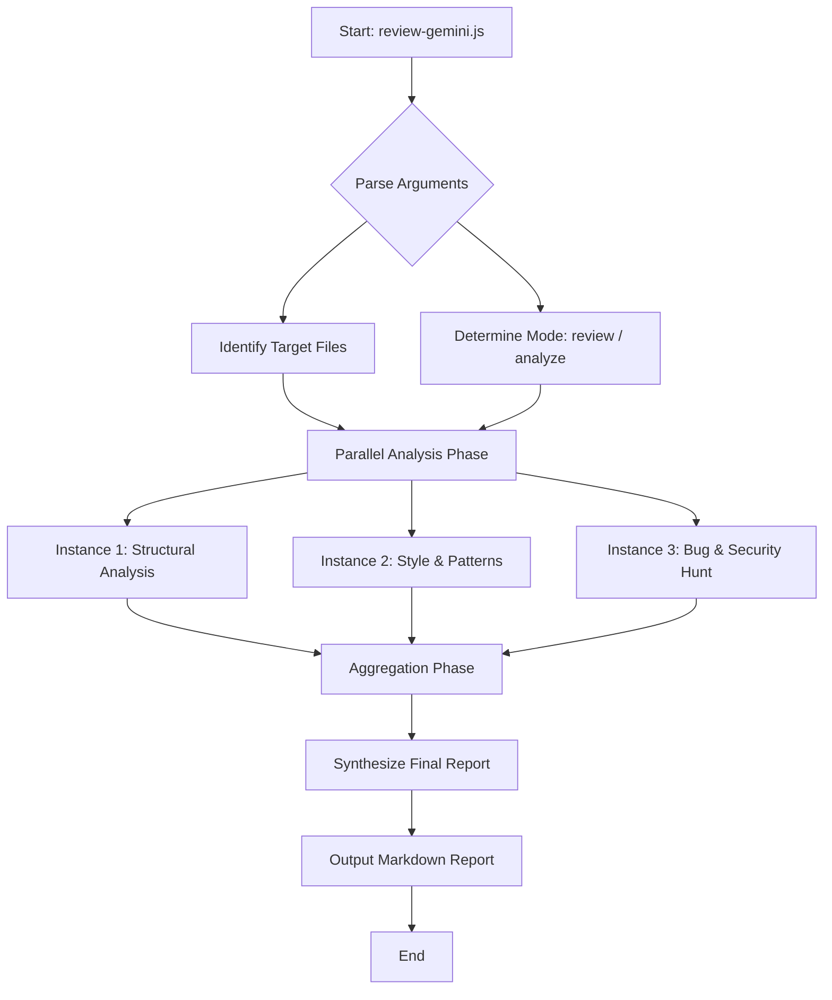

# Gemini Code Review Skill

A specialized skill for running parallel, adversarial code reviews and comprehensive architecture analysis using the Gemini API.

## Version
`2.1.0`

## Code Structure
The skill consists of the following components:
*   **`review-gemini.js`**: The main execution script. It handles argument parsing, calls the Gemini API (defaulting to `gemini-2.5-flash`), coordinates the parallel review/analysis steps, and synthesizes the final report.
*   **`SKILL.md`**: The skill definition and instruction file for the AI agent, explaining how to invoke the tool and validate output.
*   **`DESIGN_DOC.md`**: Detailed technical design document covering the architecture, configuration, and implementation details of the review system.

## Workflow
The code review workflow operates as follows:



1.  **Invocation**: The agent or user invokes `review-gemini.js` with target files and optional flags:
    ```bash
    node review-gemini.js [files...] --mode [review|analyze] --temperature [temp] --lang [lang]
    ```
2.  **Analysis**:
    *   **Review Mode**: Runs parallel reviews focusing on different aspects (correctness, security, style) and synthesizes findings.
    *   **Analyze Mode**: Analyzes code structure, dependencies, and architecture.
3.  **Synthesis**: Combines results from parallel runs, deduplicates issues, and formats them into a structured Markdown report.
4.  **Localization**: The final report is generated in the language specified by the `--lang` flag (defaults to English).
